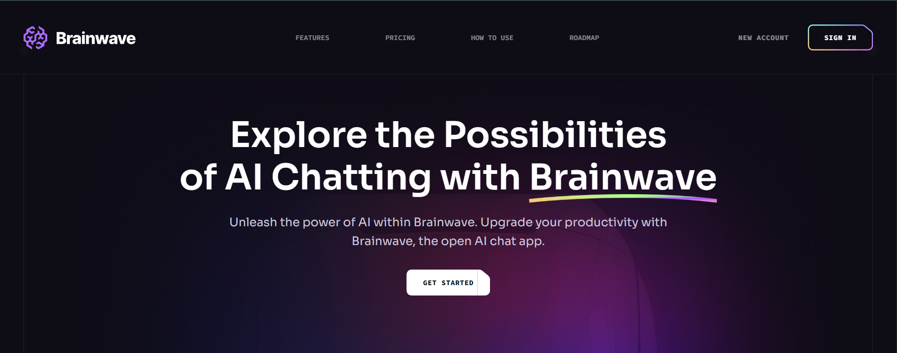
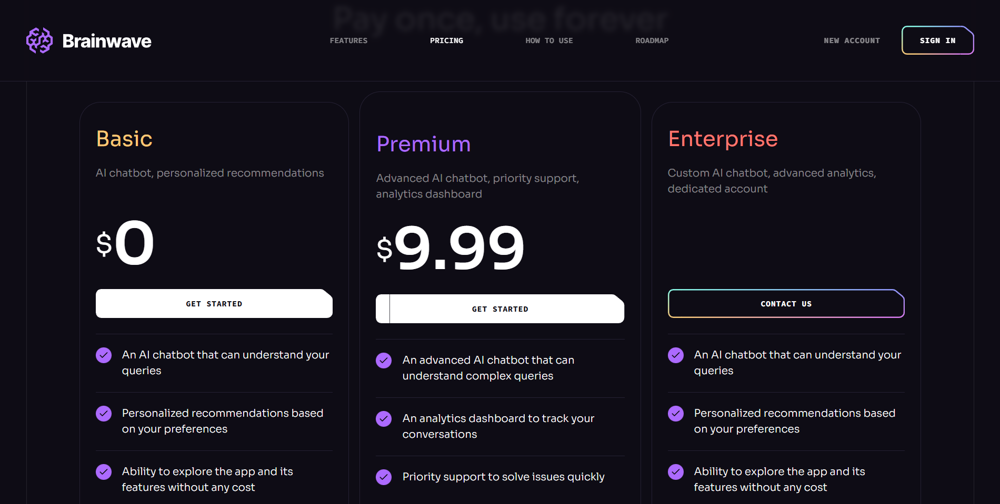

# **React Tailwind Skills**
### 🔗 Live Demo  
**GitHub Pages:** https://mohannadhamdy2003.github.io/React-tailwind-skills/

A modern and responsive React project built to demonstrate my practical understanding of **Tailwind CSS**, component-based UI architecture, and utility-first styling.
This project focuses on real UI sections and production-style coding — not just examples.

---

## 🚀 **Why I Built This Project**

I created this project to:

* Strengthen my Tailwind CSS workflow
* Learn how to create clean, responsive layouts using utility classes
* Understand Tailwind’s design system (spacing, colors, fonts, breakpoints…)
* Practice designing UI components from scratch
* Build a project that reflects my frontend skills
* Apply Tailwind in a real React environment (with Vite)

---

## 🎯 **Tailwind Concepts I Learned**

### **1️⃣ Responsive Design**

* Built fully responsive sections
* Used Tailwind breakpoints: `sm`, `md`, `lg`, `xl`, `2xl`
* Built layouts using **mobile-first** logic
* Used reverse responsive utilities like `max-lg:` to control layout collapse

### **2️⃣ Layout, Flexbox & Grid**

* `flex`, `flex-col`, `flex-wrap`, `justify-between`, `items-center`
* Responsive grid patterns
* Spacing using `gap-*` and `px-* / py-*`
* Adaptive layouts depending on screen size

### **3️⃣ Positioning & Layering**

* `relative`, `absolute`, `inset-0`, `top-*`, `left-*`
* Used `z-*` for layering text and backgrounds

### **4️⃣ Typography**

* Custom heading classes (`h2`, `h3`, `h4`)
* Controlled font size, weight, and tracking using utilities
* Reusable typography patterns

### **5️⃣ Interactive State Styling**

* Hover states using `hover:*`
* Smooth animations: `transition`, `duration-300`, `opacity-*`
* Active link detection with **React Router + `useLocation`**

### **6️⃣ Visual & Background Effects**

* `bg-cover`, `bg-center`, `bg-no-repeat`
* Dynamic background images
* Blur effects (`backdrop-blur-sm`)
* Opacity transitions

### **7️⃣ Component-Based Tailwind Workflow**

I used Tailwind inside reusable React components such as:

* Navbar / Header
* Custom Button component
* Pricing cards
* Benefits section
* Layout wrappers
* SVG-driven UI components

---

## 🎛️ **Understanding My Tailwind Config**

One of the most important parts of this project was learning how to **customize `tailwind.config.js`** to match the design system.

### ✔️ What I configured:

#### **1. Custom Colors**

I added my own color palette (`color-1`, `color-2`, etc.) for consistent branding.

#### **2. Custom Fonts**

Extended `fontFamily` to match my UI design.

#### **3. Custom Screens**

Used Tailwind’s default breakpoints + adapted some styles using `max-lg:` and `max-md:`.

#### **4. Background Images**

Registered custom background patterns using:

```js
extend: {
  backgroundImage: {
    "hero-pattern": "url('/path')",
  }
}
```

#### **5. Content Paths**

Made sure Tailwind scans:

* `/src/**/*.{js,jsx}`
* `/public/index.html`

This ensures all utilities are generated properly.

### ✔️ Why this matters:

Understanding the config file is what separates “basic Tailwind usage” from **knowing Tailwind professionally**.
You gain full control over the design system instead of depending on defaults.

---
## ✨ **Features**

* Fully responsive layout
* Modern UI built purely with Tailwind
* Active navigation highlighting
* Smooth hover animations
* Reusable components
* Pricing, benefits, and layout sections
* Organized folder structure
* Production-style design approach

---

## 🛠 **Technologies Used**

* **React**
* **Tailwind CSS**
* **JavaScript / JSX**
* **Vite**

---

## 📸 **Screenshots**

### 🟦 Header Section


### 🟩 Pricing Section


---

## 📚 **What I Learned**

This project helped me develop:

* A strong Tailwind utility-first workflow
* Responsive layouts without writing custom CSS
* Clean React component architecture
* Ability to style components using design tokens
* Confidence working with Tailwind config
* Better organization of UI components and assets
* Practical skills in building modern, reusable, responsive UIs
